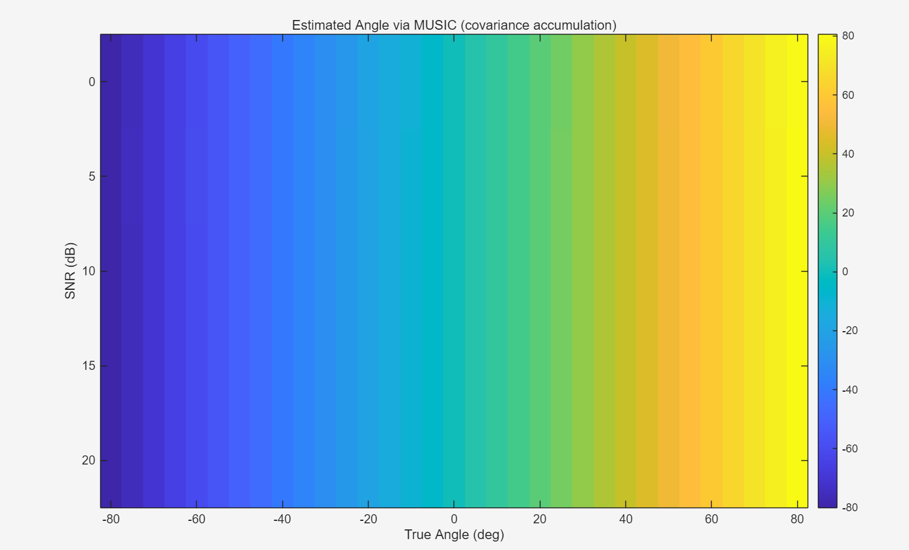
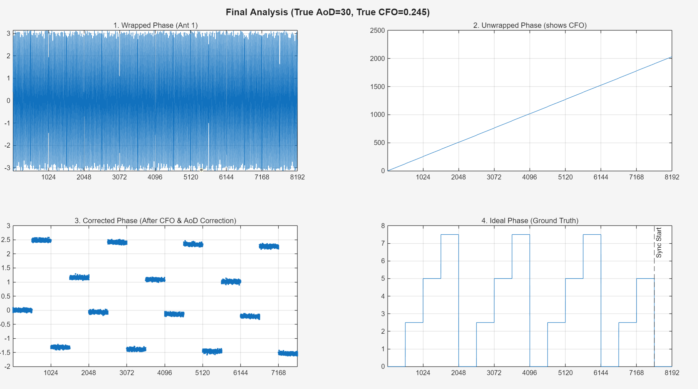
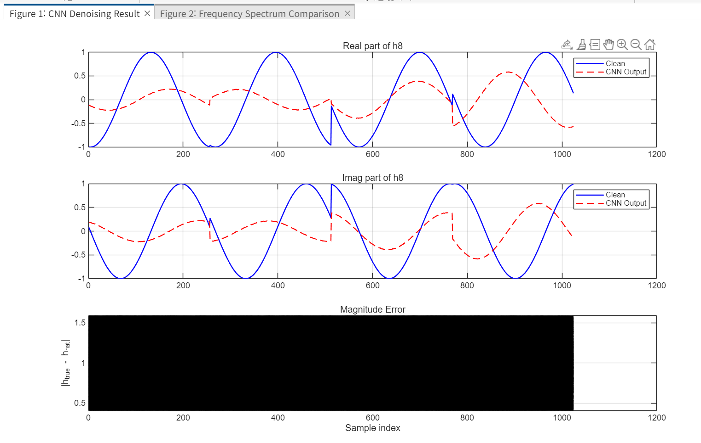
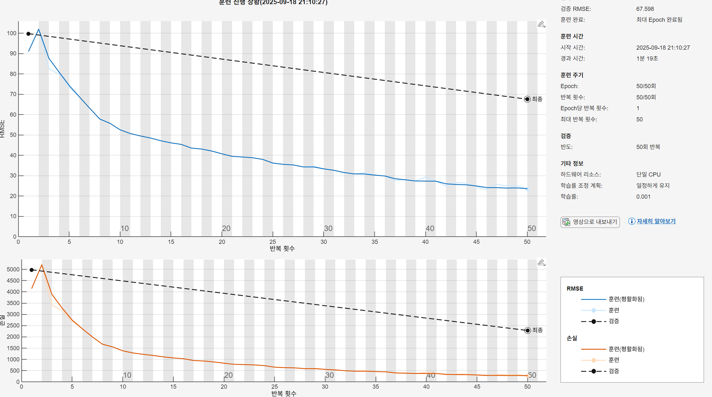

# MUSIC 기반 실내 위치추정 연구

학부연구생 활동 중 진행한 실내 위치추정 연구 기록입니다. 실내에서는 GPS 신호 활용이 제한적이기 때문에, 무선 신호의 수신 특성과 안테나 배열 정보를 이용해 위치 또는 방향을 추정할 수 있는지 검토했습니다. 특히 MUSIC 알고리즘 기반 AoD/DoA 추정이 실내 GPS 방식의 탐색에 활용 가능한지 실험했습니다.

## 프로젝트 개요

이 연구 기록은 MATLAB 기반 시뮬레이션과 딥러닝 보정 실험을 포함합니다.

- MUSIC 기반 AoD/DoA 추정 실험
- SNR 변화에 따른 추정 성능 분석
- MISO/SIMO/MIMO 채널 데이터 생성
- 수신 위상, phase unwrapping, CFO 영향 분석
- CNN 기반 채널/위상 denoising 및 복원 가능성 검토
- RMSE 기반 학습/검증 결과 관찰

## 연구 동기

실내 위치추정에서는 벽, 반사, 다중경로, 잡음 때문에 단순한 거리 기반 방식만으로 안정적인 탐색이 어렵습니다. 이 프로젝트에서는 안테나 배열 신호처리 기법인 MUSIC을 활용해 신호의 도래/출발 각도를 추정하고, 그 결과가 실내 탐색 시스템에 쓸 수 있을 만큼 안정적인지 확인하는 것을 목표로 했습니다.

## 연구 질문

- MUSIC 알고리즘으로 다양한 SNR 조건에서 AoD/DoA를 안정적으로 추정할 수 있는가?
- 수신 위상 왜곡, CFO, 잡음이 각도 추정에 어떤 영향을 주는가?
- CNN 기반 denoising 또는 복원 모델이 MUSIC 추정 전처리에 도움이 되는가?
- 시뮬레이션 기반 결과를 실내 위치추정 시스템의 기초 자료로 사용할 수 있는가?

## 진행 방법

1. MATLAB에서 무선 채널 및 안테나 배열 조건을 설정했습니다.
2. AoD/DoA 각도와 SNR 조건을 바꾸며 수신 신호 데이터를 생성했습니다.
3. MUSIC 기반 각도 추정 결과를 관찰했습니다.
4. 수신 위상, unwrapped phase, CFO 보정 전후 결과를 비교했습니다.
5. CNN 회귀 모델을 사용해 noisy channel/phase를 복원하는 실험을 진행했습니다.
6. RMSE와 시각화 결과를 바탕으로 추정 안정성을 분석했습니다.

## 폴더 구조

```text
indoor-localization-music-aod/
  README.md
  docs/
    images/
    notes/
  experiments/
  results/
```

| 폴더 | 설명 |
| --- | --- |
| `docs/images` | 대표 결과 이미지 |
| `docs/notes` | 연구 요약, 실험 흐름, 공개 범위 정리 |
| `experiments` | 원본 실험 파일 목록과 향후 공개 가능 자료 정리 |
| `results` | 결과 이미지 해석 요약 |

## 대표 결과

### MUSIC 각도 추정



SNR과 실제 각도 조건을 바꾸며 MUSIC 기반 추정 결과를 관찰했습니다.

### 위상 보정



Wrapped phase, unwrapped phase, CFO 보정, 이상적인 ground truth phase를 비교했습니다.

### CNN Denoising



채널 또는 위상 성분의 clean signal과 CNN 복원 결과를 비교했습니다.

### 학습 진행 과정



CNN 학습 과정에서 RMSE와 loss가 감소하는지 확인했습니다.

## 원본 작업 폴더의 주요 자료

원본 작업 폴더 기준 주요 자료는 다음과 같습니다.

| 종류 | 예시 |
| --- | --- |
| MATLAB 스크립트 | `test_0.m`, `test_1.m`, `test_1101_1.m`, `test_1106_1.m`, `test_1110_1.m`, `test_1121.m` |
| 채널 데이터셋 | `dataset_h5`, `AoD_simu(08.08)`, `DoA_Simu` |
| 학습 모델 | `SIMO_h8_model_SNR0.mat`, `SIMO_h8_model_SNR5.mat`, `SIMO_h8_model_SNR10.mat`, `model_h8_cnn_music.mat` |
| MATLAB 생성 패키지 | `+MISO_TML_TDL_MUSIC_h8_10`, `+haerang_MIMO_model_h8_denoising_10` |

대용량 원본 데이터와 학습된 모델 파일은 공개용 저장소에서 제외합니다.

## 기술 스택

- MATLAB
- Phased-array / 안테나 신호처리
- MUSIC 알고리즘
- CNN 회귀 모델
- MISO, SIMO, MIMO 채널 시뮬레이션
- RMSE 기반 평가

## 배운 점

- MUSIC 기반 각도 추정의 기본 흐름과 한계를 이해했습니다.
- SNR, CFO, phase wrapping이 수신 신호 해석에 미치는 영향을 확인했습니다.
- 시뮬레이션 데이터 생성, 모델 학습, 결과 시각화 과정을 경험했습니다.
- 연구 기록을 남길 때 원본 데이터와 공개 가능한 요약 자료를 분리해야 한다는 점을 배웠습니다.

## 공개 범위

이 저장소는 학부연구생 활동의 공개 가능한 요약과 개인 학습 기록만 포함하는 것을 권장합니다. 연구실 내부 자료, 미공개 데이터, 대용량 원본 데이터, 지도교수 또는 연구실 소유 문서는 포함하지 않습니다.
